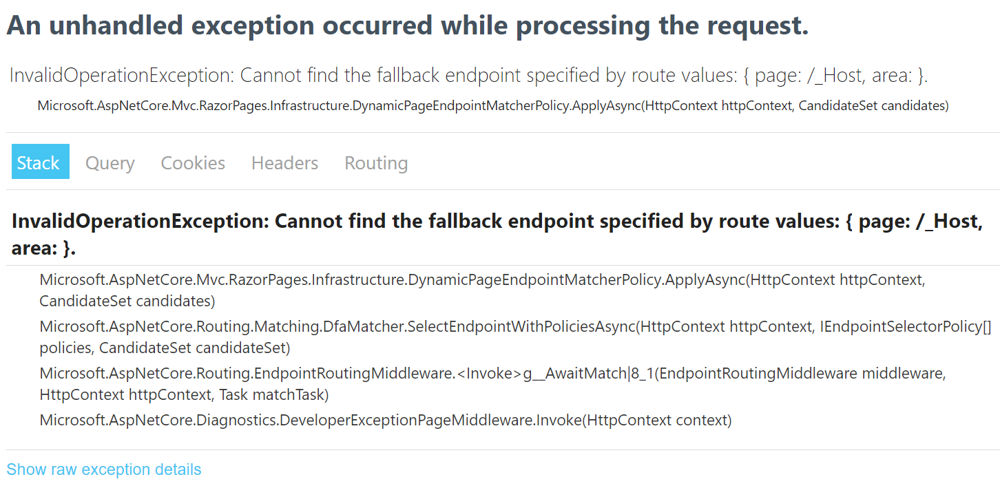

# Blazor Hosting Repro

 I'm trying to host Blazor Server inside a desktop application, but am running into a Razor routing failure at runtime:

 ```
 System.InvalidOperationException: Cannot find the fallback endpoint specified by route values: { page: /_Host, area:  }.
   at Microsoft.AspNetCore.Mvc.RazorPages.Infrastructure.DynamicPageEndpointMatcherPolicy.ApplyAsync(HttpContext httpContext, CandidateSet candidates)
   at Microsoft.AspNetCore.Routing.Matching.DfaMatcher.SelectEndpointWithPoliciesAsync(HttpContext httpContext, IEndpointSelectorPolicy[] policies, CandidateSet candidateSet)
   at Microsoft.AspNetCore.Routing.EndpointRoutingMiddleware.<Invoke>g__AwaitMatch|8_1(EndpointRoutingMiddleware middleware, HttpContext httpContext, Task matchTask)
   at Microsoft.AspNetCore.Diagnostics.DeveloperExceptionPageMiddleware.Invoke(HttpContext context)
```

I am using the latest .NET 6 ASP.NET core minimal hosting APIs, but in a way that is somewhat unusual. I'm not sure if this is an issue with how I am hosting Blazor or an ASP.NET bug.

## Steps to Reproduce

I have created a Blazor project named BlazorServer using the .NET 6 Blazor Server template project (the new one using minimal APIs), converted it to a library project, and moved Program.cs largely as-is into a static function in `Hosting.cs`:

```cs
public static async Task<WebApplication> StartOnThreadpool() =>
    await Task.Run(async () =>
            await Task.Run(async () =>
        {
            var builder = WebApplication.CreateBuilder();
            ...
            await app.StartAsync();
            return app;
        });
```

The only changes from the template are `app.Urls.Add("http://localhost:5003");` and calling `StartAsync()` instead of `Run()`.

Inside ConsoleApp, I start up ASP.NET:

```cs
await BlazorServer.Hosting.StartOnThreadpool();
```

Then navigate to https://localhost:5003 to see the error:



## Fixes attempted

I've tried setting the ContentRootPath and ApplicationName without any luck:

```cs
string crp = @"C:\Users\reill\source\WebView\BlazorServer";
var builder = WebApplication.CreateBuilder(new WebApplicationOptions() { ContentRootPath = crp, ApplicationName = "WebView" });
```

I've also tried enabling Trace logging but that doesn't provide any additional info.

## Version Info

- Windows 10 21H1
- Visual Studio Version 17.0.0 Preview 3.1
- .NET 6.0.100-rc.2.21423.17 (obtained from `dotnet --version`)
